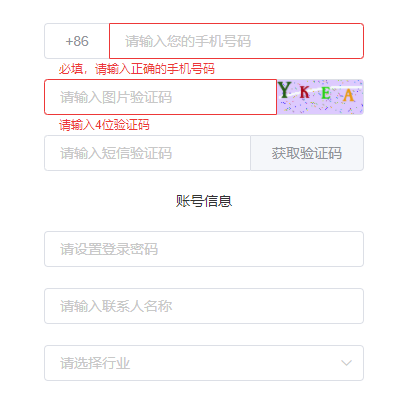
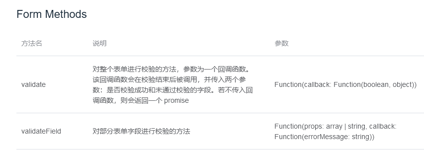
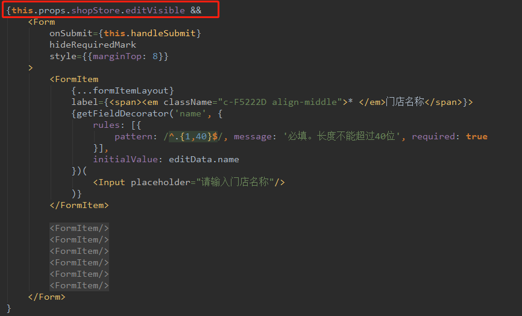

## frontend-problems <h3>前端开发遇到的问题与解决方案集锦</h3>

##### Vue篇

1. Element UI表单对部分字段进行校验的问题
   
   
   
   比如获取验证码可以单独校验上面2个字段，validateField 校验多少个字段，回调就会调多少次，跟validate只会有一次回调不同，所以需要做特殊处理。



   示例代码：

```javascript
    // 获取短信验证码
    getMsgCode() {
      const errorArr = []

      this.$refs.phoneForm.validateField(['mobile', 'picCode'], error => {
        errorArr.push(error)

        // 校验callback会回调配置数组的次数
        if (errorArr.length === 2 && !errorArr[0] && !errorArr[1]) {
          // 校验成功
        }
      })
    }
```


##### React篇

1. antd的form表单要复用的话，可以每次重渲一遍，就不会上次输入的input值出现在新打开的表单里
   
   
